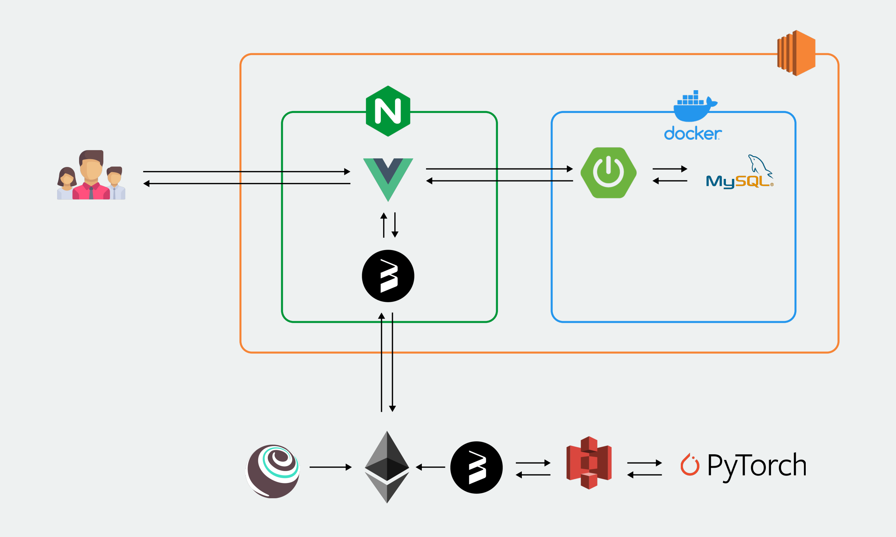
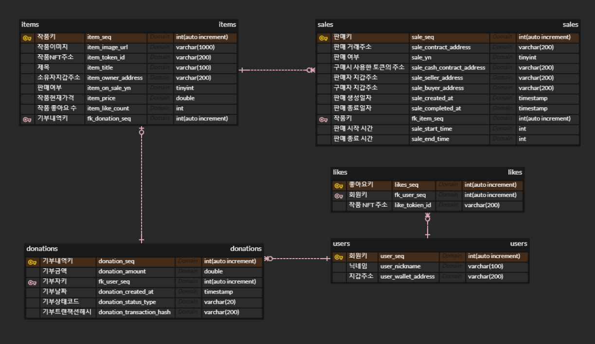

<div align="center">
  <h1>핸드 투 핸드 (Hand to Hand)</h1>
  <br/>
</div>

## 목차

1. [**웹 서비스 소개**](#1)
1. [**기술 스택**](#2)
1. [**주요 기능**](#3)
1. [**프로젝트 구성도**](#4)
1. [**개발 팀 소개**](#5)
1. [**개발 기간**](#6)
1. [**실행 방법**](#7)

<br />

<div id="1"></div>

## 💁 웹 서비스 소개

**핸드 투 핸드 (Hand to Hand)** 는 우크라이나 기부를 독려하기 위한 프로젝트입니다.

1. 우크라이나 정부에 암호화폐를 기부할 수 있습니다.
2. 암호화폐를 기부하면 AI가 그린 우크라이나 풍경화 NFT를 받을 수 있습니다.
3. 리워드로 받은 NFT를 판매, 입찰, 구매할 수 있습니다.

<br />

<div id="2"></div>

## 🛠 기술 스택

### **Front-end**

|  |  |  |
| :----------------------------------------------------------------------------------------------------------------------------: | :--------------------------------------------------------------------------------------------------------------------------: | :-----------------------------------------------------------------------------------------------------------------------------: |
|                                                             HTML5                                                              |                                                             CSS3                                                             |                                                           javascript                                                            |

|  |  |  |  |
| :-------------------------------------------------------------------------------------------------------------------------------: | :-----------------------------------------------------------------------------------------------------------------------------------------------------: | :-------------------------------------------------------------------------------------------------------------------------: | :----------------------------------------------------------------------------------------------------------------------: |
|                                                                Vue                                                                |                                                                          Vuex                                                                           |                                                           web3.js                                                           |                                                        Bootstrap                                                         |

### **Blockchain**

|  |
| :---------------------------------------------------------------------------------------------: |
|                                           truffle.js                                            |

### **AI**

|  |
| :-------------------------------------------------------------------------------------------------------: |
|                                                  PyTorch                                                  |

### **Back-end**

|  |  |  |
| :--------------------------------------------------------------------------------------------------------------------------: | :---------------------------------------------------------------------------------------------------------------------------------------------: | :----------------------------------------------------------------------------------------------------------------------------: |
|                                                             Java                                                             |                                                                   Spring-Boot                                                                   |                                                             MySQL                                                              |

### **DevOps**

|  |  |  |
| :-------------------------------------------------------------------------------------------------------------------: | :------------------------------------------------------------------------------------------------------------------------------: | :------------------------------------------------------------------------------------------------------------------------------: |
|                                                         NGiNX                                                         |                                                               aws                                                                |                                                              docker                                                              |

<br />

<div id="3"></div>

## 💡 주요 기능

| 기능           | 내용                                                                  |
| :------------- | :-------------------------------------------------------------------- |
| 지갑 연결      | 개인 키를 입력하여 지갑을 연결할 수 있습니다.                         |
| 기부           | 연결된 지갑의 잔액을 조회하고, 잔액 미만의 금액을 기부할 수 있습니다. |
| 기부 내역 확인 | 나의 기부 내역을 확인할 수 있습니다.                                  |
| NFT 발급       | 나의 기부 내역에서 NFT를 발급 받을 수 있습니다.                       |
| NFT 조회       | 다른 사람들의 NFT, 내가 보유한 NFT를 조회할 수 있습니다.              |
| NFT 거래       | NFT를 판매, 입찰, 구매할 수 있습니다.                                 |

<br />

<div id="4"></div>

## 📂 프로젝트 구성도

|                                   아키텍처(Architecture)                                   |
| :----------------------------------------------------------------------------------------: |
|  |

|                              개체-관계 모델(ERD)                               |
| :----------------------------------------------------------------------------: |
|  |

<br />

<div id="5"></div>

## 👪 개발 팀 소개

<table>
  <tr>
    <td align="center" width="150px">
      <a href="#" target="_blank">
        
      </a>
    </td>
    <td align="center" width="150px">
      <a href="#" target="_blank">
        
      </a>
    </td>
    <td align="center" width="150px">
      <a href="#" target="_blank">
        
      </a>
    </td>
    <td align="center" width="150px">
      <a href="#" target="_blank">
        
      </a>
    </td>
    <td align="center" width="150px">
      <a href="#" target="_blank">
        
      </a>
    </td>
  </tr>
  <tr>
    <td align="center">
      <a href="https://github.com/zbqlr456" target="_blank">
        김응철<br />(Backend)
      </a>
    </td>
    <td align="center">
      <a href="https://github.com/82surf" target="_blank">
        유현수<br />(Frontend & Blockchain)
      </a>
    </td>
    <td align="center">
      <a href="https://github.com/tlsqktem483" target="_blank">
        이상백<br />(AI & Blockchain & Frontend )
      </a>
    </td>
    <td align="center">
      <a href="https://github.com/EuneeChung" target="_blank">
        정은이<br />(Backend)
      </a>
    </td>
    <td align="center">
      <a href="https://github.com/yeon-s" target="_blank">
        황승연<br />(Backend & DevOps)
      </a>
    </td>
  </tr>
</table>

<br />

<br />

- |  이름  |            역할            | <div align="center">개발 내용</div>                          |
  | :----: | :------------------------: | :----------------------------------------------------------- |
  | 김응철 |          Backend           | - Test Server 구현<br />- DB 설계 <br />- JPA 구조 설계<br />- 판매API<br/>    &nbsp; - 판매 정보 등록 API<br/>  &nbsp; - 판매 조회 API<br /> &nbsp; - 판매 취소 API<br />  &nbsp; - 판매 완료 API<br />  &nbsp; - 구매자 정보 업데이트 API |
  | 유현수 |   Frontend & Blockchain    | - 지갑 연결 및 회원관리 <br /> - 잔액 확인 및 송금 <br /> - 송금 내역 조회 <br /> - NFT 발급 <br /> - 내 NFT 조회 <br /> - API 호출 모듈 <br />- web3 트랜잭션 모듈 <br /> - vuex, Router |
  | 이상백 | AI & Blockchain & Frontend | **1. [블록체인] 스마트 컨트랙트 설계 <br />** A. HandToHand 개별 토큰 개발 (HTH, ERC-20)<br /> 1) `Ownable` 도입으로 토큰의 발행 주체 단일화<br /> 2) Gas 비용 절감을 위한 조회용 `view` 함수 조회<br /> 3) 송금에 중간 개입자 개입을 위한 `approve` 함수 구현<br /><br /> B. NFT 개발 (ERC-721)<br /> 1) 토큰 발행 주체의 단일화<br /> 2) 조회용 `view` 함수 구현 (NFT 정보 조회시 Gas 비용 절감)<br /> 3) NFT 이전에 중간 개입자 개입을 위한 `approve` 함수 구현<br /><br /> C. 서비스 개별 토큰(HTH)을 이용한 NFT 거래 플랫폼 개발<br /> 1) `SaleFactory` 컨트랙트 도입 및 `Sale` 주체 단일화<br /> 2) NFT 입찰 및 판매에 생성되는 Sale 컨트랙트 구현<br /> 3) 각 동작별 분기처리를 위한 `Modifier` 함수 구현<br /> 4) 입찰, 판매 동작시 log 기록을 위한 `Event` 함수 구현<br /><br /> **2. [인공지능] Deep Learning 모델 설계<br />** A. 목표 결과물 설정<br /> 1) 우크라이나의 풍경화, 도시화 학습 모델 설정<br /> 2) style 변수를 입힌 GAN 모델 모색, StyleGAN3 모델 설정<br /><br /> B. Training 데이터 수집<br /> 1) 우크라이나 자연 및 도시 풍경 Crawling 이미지 (약 3,000 개)<br /> 2) WikiArt cityscape image (약 5,000 개)<br /> 3) WikiArt landscape image (약 5,000 개)<br /><br /> C. GAN 모델 학습<br /> 1) 1차 학습 : `gamma=8.2`, 약 4-5 일 학습 진행<br /> 2) 2차 학습 : `gamma=6.6`, 약 1-2 일 학습 진행<br /><br /> D. 결과물 도출 및 검증<br /> 1) 학습 모델 활용 이미지 생성 (약 2,600개)<br /> 2) `FID` 값 10~11 에 수렴<br /> 3) `kimg` 값 4500~5000 도달<br /><br /> **3. [프론트] NFT 거래 페이지 구현<br />** A. Front <=> SSAFY 네트워크 (블록체인) 연결<br /> 1) 블록체인 연결에 Web3 라이브러리 도입<br /> 2) Front 에서 `approve` 권한 구현<br /><br /> B. NFT 판매, 입찰 동작 구현<br /> 1) 스마트 컨트랙트 함수 기반의 판매, 입찰 동작 구현<br /> C. NFT 거래 내역 기록<br /> 1) 스마트 컨트랙트 동작 후, 서비스 개별 DB 에 기록 |
  | 정은이 |       Backend & 팀장       | - Test Server 구현<br />- DB 설계<br />- JPA 구조 설계<br />- Spring Boot S3 연결<br/> - 기부 API<br/>  &nbsp; - 기부 요청 API<br/>  &nbsp; - 기부 상태 업데이트 API<br />  &nbsp; - 기부 조회 API<br />\- 작품 API<br/>  &nbsp; - 파일 업로드 API<br/>  &nbsp; - 작품 지급 API<br/>  &nbsp; - 작품 정보 업데이트 API<br /> &nbsp; - 작품 상세 조회 API<br />\- 회원API<br/>  &nbsp; - 지갑 연동 API<br/> &nbsp; - 닉네임 변경 API |
  | 황승연 |          Backend           | 1.백엔드<br /> -전체 작품 목록 조회 API 구현<br/> -특정 wallet address가 보유한 작품 목록 조회API 구현<br/> -판매중인 작품 목록 조회 API 구현<br /> -좋아요 업데이트 API 구현<br/> 2.서버 및 배포<br/> -AWS EC2 서버 세팅 <br/> -AWS EC2와 Docker 활용한 DB 구축<br/> -Docker 활용한 SpringBoot 배포<br/> -Nginx 수동 배포 |


<div id="6"></div>

## 📅 개발 기간

22.02.21. ~ 22.04.08

<br />

<div id='7'></div>

## 💻 실행 방법

### Client 실행

1. **원격 저장소 복제**

```bash
$ git clone [레포지토리 주소]
```

2. **프로젝트 폴더로 이동**

```bash
$ cd frontend-vue
```

3. **필요한 node_modules 설치**

```bash
$ npm i
```

4. **개발 서버 실행**

```bash
$ npm run serve
```

<br />

### Main Server 실행

1. **원격 저장소 복제**

```bash
$ git clone [레포지토리 주소]
```

2. **프로젝터 폴더 > src > main > resources 이동**

```bash
$ cd spring-backend
```

3. **https 설정을 위한 key store file & trust keystore file 추가**

```bash
$ cd spring-backend\src\main\resources
```

- key store file 추가
- trust store file 추가

4. **프로젝트 실행을 위한 yml 파일 작성**

```bash
server:
  port: 8081
  ssl:
    enabled: true
    key-alias: [key-alias]
    key-store: classpath:[keystore file]
    key-store-password: [key-store-password]
    key-password: [key-password]
    trust-store: classpath:[trust keystore file]
    trust-store-password: [keystore file]

spring:
  datasource:
    url: [DB URL]
    username: [ssafy]
    password: [ssafy]
    driver-class-name: com.mysql.cj.jdbc.Driver
  mvc:
    pathmatch:
      matching-strategy: ant_path_matcher
jpa:
  generate-ddl: false
  open-in-view: false
  hibernate:
    ddl-auto: validate # 엔티티와 테이블이 정상 매핑되었는지만 확인
  properties:
    hibernate:
      format_sql: true
logging.level:
  org.hibernate.SQL: debug  # 모든 hibernate가 생성하는 SQL이 디버그 모드로 로거로 다 찍힘(운영환경에서 권장!)
  org.hibernate.type: trace

cloud:
  aws:
    credentials:
      access-key: [S3 ACCESS KEY]
      secret-key: [S3 SECRET KEY]
    s3:
      bucket: [BUCKET]
    region:
        static: ap-northeast-2
```

5. **프로젝트 실행을 위한 env 파일 작성**

```bash
APP_PORT=3001
CHOKIDAR_USEPOLLING=true
SKIP_PREFLIGHT_CHECK=true

VUE_APP_ENV=production
VUE_APP_BACKEND_HOST_URL=[백엔드 url]
VUE_APP_ETHEREUM_RPC_URL=[이더리움 url]

VUE_APP_SALE_FACTORY_CA=0xDAc66969f7031a92F48BACd1A8907bbf78bC2253
VUE_APP_NFT_CA=0x5F2D9F51c1453C708700e46FD400A3a6A9b7A5F0
VUE_APP_ERC20_CA=0xd7D2b2859e8485eF94dA0B11c421c77c48311981

VUE_APP_ADMIN_ADDRESS=0x4135f8fD42c98cAb53883863b6b80A7AA806e0E9
VUE_APP_ADMIN_PRIVKEY=0xe20c61798cad4c6edb27c902e3592d9c0f92983239fef77f334a3701e7bad767

VUE_APP_API_BASE_URL=[서버 url]
```
<br />

<div id='8'></div>

## 💾빌드 및 배포 

### 1. 사용한 JVM, 웹서버, WAS 제품 등의 종류와 설정값, 버전(IDE 버전 포함) 기재

### 종류

웹서버 - Nginx

WAS - Tomcat

### 버전

**Backend**

Java - OpenJDK 11.0.14.1

spring-boot - 2.6.3

spring 내장 tomcat - 2.6.3

gradle - 7.4.1

**Frontend**

node - 14.18.1

npm - 6.14.15

nginx - 1.18.0(Ubuntu)

**IDE**

intelliJ IDEA - 2021.3.1

Visual Studio Code - 1.66.0

### 2. 빌드 시 사용되는 환경변수 등의 주요 내용 상세 기재

### Frontend

**frontend-vue/`.env` 파일 추가**

```bash
APP_PORT=3001
CHOKIDAR_USEPOLLING=true
SKIP_PREFLIGHT_CHECK=true

VUE_APP_ENV=production
VUE_APP_BACKEND_HOST_URL=[백엔드 url]
VUE_APP_ETHEREUM_RPC_URL=[이더리움 url]

VUE_APP_SALE_FACTORY_CA=0xDAc66969f7031a92F48BACd1A8907bbf78bC2253
VUE_APP_NFT_CA=0x5F2D9F51c1453C708700e46FD400A3a6A9b7A5F0
VUE_APP_ERC20_CA=0xd7D2b2859e8485eF94dA0B11c421c77c48311981

VUE_APP_ADMIN_ADDRESS=0x4135f8fD42c98cAb53883863b6b80A7AA806e0E9
VUE_APP_ADMIN_PRIVKEY=0xe20c61798cad4c6edb27c902e3592d9c0f92983239fef77f334a3701e7bad767

VUE_APP_API_BASE_URL=[서버 url]
```

**AWS에서 빌드 과정**

1. Git 설치 및 연동(**/home/ubuntu 경로에서**)
    
    ```powershell
    apt-get install git
    git clone https://lab.ssafy.com/s06-blockchain-nft-sub2/S06P22B209.git
    # 로그인
    ```
    
2. build
    
    ```powershell
    cd frontend-vue 폴더로
    npm install
    npm run build
    ```
    

### Backend

**spring-backend/src/main/resources/`application.yml` 파일 추가**

```bash
spring:
  datasource:
    url: [DB URL]
    username: ssafy
    password: ssafy
    driver-class-name: com.mysql.cj.jdbc.Driver
  mvc:
    pathmatch:
      matching-strategy: ant_path_matcher
jpa:
  generate-ddl: false
  open-in-view: false
  hibernate:
    ddl-auto: validate
  properties:
    hibernate:
      format_sql: true
logging.level:
  org.hibernate.SQL: debug  
  org.hibernate.type: trace

cloud:
  aws:
    credentials:
      access-key: [S3 ACCESS KEY]
      secret-key: [S3 SECRET KEY]
    s3:
      bucket: [BUCKET]
    region:
        static: ap-northeast-2
```

**AWS에서 빌드 과정**

1. Java 설치
    
    ```bash
    apt-get install openjdk-11-jdk
    ```
    
2. build
    
    ```bash
    cd backend-spring 폴더로
    sudo chmod 777 ./gradlew  # 폴더나 파일에 권한부여(777 - 모든 권한)
    sudo ./gradlew build      # build
    ```
    

### 3. 배포 시 특이사항 기재

### Frontend

### 방법 - AWS에서 nodejs로 빌드 후, NGINX로 실행

**빌드전**

1. NGINX 설치
    
    ```bash
    #root계정이나 sudo 명령어 사용
    apt-get update  
    apt-get upgrade 
    apt-get install nginx
    ```
    
2. NGINX 환경설정
    
    ```bash
    cd /etc/nginx/sites-available
    sudo vi default
    ```
    
3. default 파일 수정
    
    ```bash
    server {
    	listen 80 default_server;
    	listen [::]:80 default_server;
    
    	root /home/ubuntu/S06P22B209/frontend-vue/dist;  # 실행시킬 dist 폴더 위치
    
    	index index.html index.htm index.nginx-debian.html;
    
    	server_name _;
    # 80/ 으로 접근 시 반응
    	location / {
    		try_files $uri $uri/ =404;
    	}
    
    # reverse proxy 설정 - 경로 재설정해줌(nginx 제공 기능 중 하나)
    # 실제 8081 포트에 접근하지 않아도 8081 포트에 접근한 것과 동일한 효과
    	location /api/ {  # 서버에 /api로 시작하는 path로 접근할 시 8081으로 돌려줌
    		proxy_pass http://j6b209.p.ssafy.io:8081/;
    		proxy_redirect off;
    		charset utf-8;
    
    		proxy_set_header X-Real-IP $remote_addr;
    		proxy_set_header X-Forwarded-For $proxy_add_x_forwarded_for;
    		proxy_set_header X-Forwarded-Proto $schem;
    		proxy_set_header X-NginX-Proxy true;
    }
    ```
    

**빌드후**

1. NGINX로 실행

```bash
#root계정이나 sudo 명령어 사용
service nginx start   # 시작
service nginx restart # 재시작
service nginx status  # 상태확인
service nginx stop    # 중지
```

### Backend

### 방법 - AWS에서 Gradle로 빌드 후, Docker에서 Spring 내장 tomcat로 실행

1. Spring-backend 폴더 내에 Dockerfile 파일 생성
    
    **Dockerfile**
    
    ```bash
    FROM openjdk:11-jdk
    EXPOSE 8081
    ARG JAR_FILE=build/libs/handtohand-0.0.1-SNAPSHOT.jar  # jar파일 경로
    COPY ${JAR_FILE} app.jar    # docker 내의 app.jar로 복사
    ENTRYPOINT ["java","-jar","/app.jar"]
    ```
    
2. Docker image 생성(빌드)
    
    ```bash
    # Dockerfile 있는 곳에서
    docker build . -t {설정할 이미지 이름}  # -t : 태그
    ```
    
3. Docker Container 실행
    
    ```bash
    docker run --name back -d -p 8081:8081 {설정한 이미지 이름}
    ```
    

### 4. DB 접속 정보 등 프로젝트(ERD)에 활용되는 주요 계정 및 프로퍼티가 정의된 파일 목록

**DB명**

handtohand

**관리자 계정**

사용자 : handtohand

암호 :  handtohand

**해당 db에 대한 권한만 가진 사용자 계정**

사용자 : ssafy

암호 : ssafy

**프로퍼티**

--character-set-server=utf8mb4 

--collation-server=utf8mb4_unicode_ci

<br />
